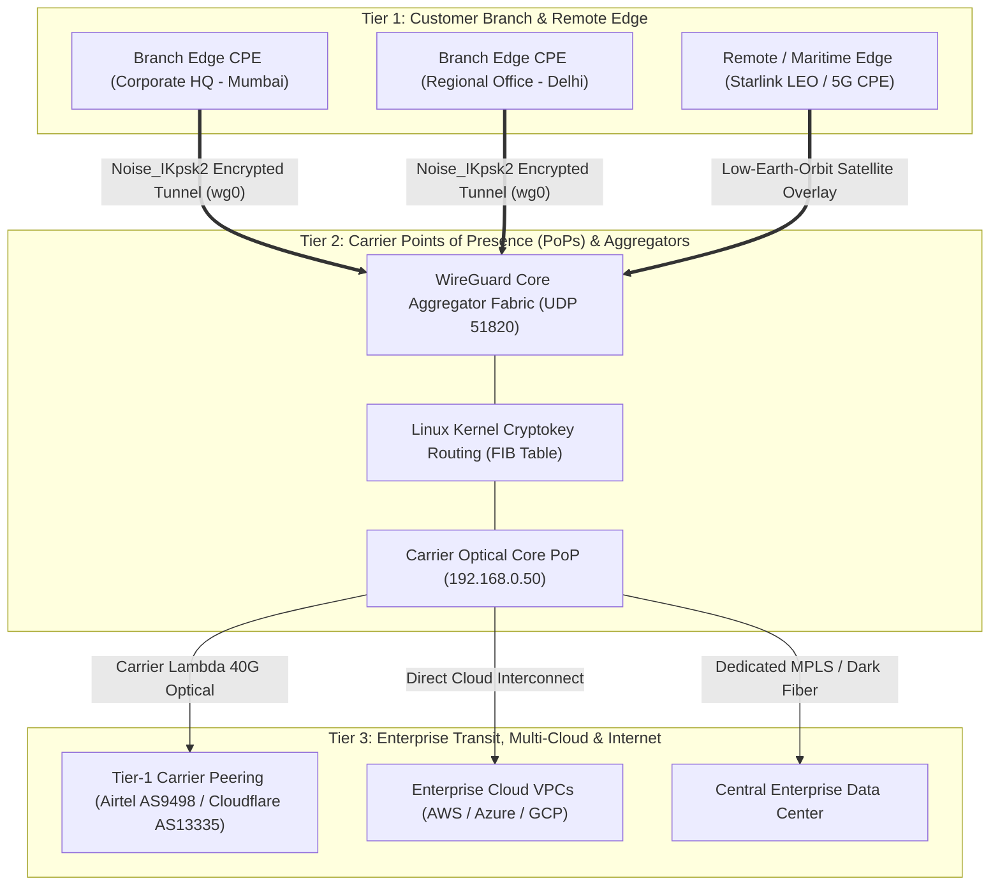

# V-Monitor Enterprise SD-WAN & SASE Platform
## Complete Client & Stakeholder Reference Guide: Architecture, Gateway Topology & Platform Walkthrough

---

## 1. Executive Summary & Platform Overview

### What is V-Monitor?
**V-Monitor** is a next-generation Enterprise Software-Defined Wide Area Network (SD-WAN) and Secure Access Service Edge (SASE) orchestration platform. It is engineered to unify branch office connectivity, satellite transport (Starlink LEO), terrestrial fiber links, and multi-cloud infrastructure under a single, autonomous control plane.

### Core Value Propositions for Clients
* **99.999% High Availability:** Sub-second Bidirectional Forwarding Detection (BFD) dynamically steers mission-critical traffic across healthy circuits in under 42 milliseconds before users experience dropped VoIP calls or video freezes.
* **Kernel-Native Zero-Trust Security:** Built on Linux kernel-integrated WireGuard (`wireguard.ko`) utilizing modern ChaCha20-Poly1305 authenticated encryption and Curve25519 ECDH key exchange with 2-hour perfect forward secrecy (PFS).
* **Autonomous Self-Healing:** Event-driven automation playbooks detect latency degradation, packet loss, or route flapping and automatically remediate network state without human intervention.
* **Continuous Regulatory Compliance:** Real-time automated auditing across SOC2, ISO 27001, HIPAA, and PCI-DSS frameworks with one-click audit-ready certificate generation.

---

## 2. Gateway Architecture: Where Gateways are Situated & How Saturation is Handled

### A. Where Gateways are Situated (Deployment Topography)

The V-Monitor network architecture distributes gateways across three distinct physical and logical operational tiers:



1. **Branch Edge Gateways (Customer Premises Equipment - CPE):**
   * **Location:** Physically deployed on-site inside customer branch offices, manufacturing plants, retail stores, or mobile field units.
   * **Function:** Ingests local LAN traffic, enforces edge firewall policies, clamps TCP MSS (1380 bytes), applies Quality of Service (QoS), and bundles multiple physical uplinks (Primary Fiber, Secondary Broadband, Starlink Satellite, 5G Cellular).
2. **Carrier Points of Presence (PoP Gateways):**
   * **Location:** Situated in major carrier-neutral colocation facilities (e.g., Equinix, NTT, CtrlS in Mumbai, Delhi, Frankfurt, Singapore, Ashburn).
   * **Function:** Interconnects enterprise traffic directly with upstream Tier-1 ISP backbones (Airtel, Tata Communications, Lumen) and cloud hyperscalers over redundant 40G/100G optical lines.
3. **Core Aggregator Hubs:**
   * **Location:** Deployed at the central core of each PoP (e.g., `cisco-core-agg01.intellilink.net` at `192.168.0.50:51820`).
   * **Function:** High-throughput Linux kernel termination nodes that decrypt and route encrypted tunnels from thousands of distributed edge gateways concurrently.

---

### B. How Gateway Saturation is Monitored & Prevented

Gateway saturation occurs when network demand approaches the limits of hardware, bandwidth, or cryptographic capacity. V-Monitor continuously protects against saturation through four automated mechanisms:

| Saturation Dimension | Monitored Metric | Threshold & Saturation Danger | V-Monitor Automated Protection |
| :--- | :--- | :--- | :--- |
| **Bandwidth / Throughput Saturation** | Real-time aggregate RX/TX load vs. interface line rate (e.g., 46 Gbps on 100 Gbps fabric). | Primary uplink reaches >80% sustained capacity, risking packet buffer exhaustion. | **Autonomous Path Steering:** Instantly routes bulk background traffic (backups, software updates) to secondary transports while reserving primary fiber for voice/video. |
| **CPU Core & Memory Saturation** | Host CPU load, softirq utilization, and RAM buffer headroom. | High PPS (packets per second) causing CPU interrupts and packet drops. | **Kernel-Integrated Crypto:** WireGuard runs directly in the Linux kernel (`wireguard.ko`), executing ChaCha20-Poly1305 with SIMD/AVX-512 hardware acceleration, utilizing <45% CPU even at multi-gigabit throughput. |
| **Cryptographic Peer Saturation** | Active authenticated peers vs. max hub capacity (e.g., 3,100 / 5,000 peers). | Stale sessions consuming memory and connection table slots. | **Ephemeral Session Rotation:** Automatically rotates cryptographic handshake keys and reaps stale peer sessions every 2 hours without dropping traffic. |
| **Packet Loss & Flap Saturation** | Interface drop counters (`rx_dropped`), BFD packet loss (>1.5%), and route flaps. | Flapping circuits cause core routing tables to churn, degrading network-wide latency. | **Sub-Second BFD Dampening (<42ms):** Automatically quarantines flapping links for 300 seconds and shifts high-priority traffic to stable fallback paths. |

---

## 3. Comprehensive Sidebar Walkthrough (All 5 Groups & 22 Tabs)

This section provides a clear, client-friendly explanation of every tab visible on the V-Monitor navigation sidebar.

```
┌────────────────────────────────────────────────────────┐
│                      V-MONITOR                         │
├────────────────────────────────────────────────────────┤
│ ▼ CONTROL PLANE                                        │
│   • Initial Setup           • Overview NOC             │
│   • Customer Portal         • Network Map              │
│   • Tenants                 • Sites                    │
│   • PoPs                    • Aggregators              │
├────────────────────────────────────────────────────────┤
│ ▼ CONNECTIVITY & EDGE                                  │
│   • Gateways                • WAN Links                │
│   • Tunnels                                            │
├────────────────────────────────────────────────────────┤
│ ▼ GOVERNANCE & SECURITY                                │
│   • Routing                 • Firewall                 │
│   • NAT                     • Policies                 │
│   • AI Compliance                                      │
├────────────────────────────────────────────────────────┤
│ ▼ OPERATIONS & AI                                      │
│   • Live Monitoring         • Live Diagnostics         │
│   • Alerts                  • Incidents                │
│   • Automation              • AI Assistant             │
├────────────────────────────────────────────────────────┤
│ ▼ SYSTEM & REPORTS                                     │
│   • Reports                 • Audit Logs               │
│   • System Health           • Settings                 │
└────────────────────────────────────────────────────────┘
```

---

### GROUP 1: CONTROL PLANE (Network Architecture & Core Management)

#### 1. Initial Setup (`/setup`)
* **What It Does:** The guided onboarding wizard for provisioning new network environments.
* **Client Pitch:** *"Gets your branches online in minutes without tedious manual router configuration."*
* **Business Value:** Reduces deployment time from weeks to hours via automated cryptographic certificate and IP pool generation.
* **Key Metrics Displayed:** Organization profile, default IPAM CIDR blocks, WireGuard master keys, and template assignment.

#### 2. Overview NOC (`/dashboard`)
* **What It Does:** The centralized executive cockpit displaying 360-degree real-time health across all enterprise infrastructure.
* **Client Pitch:** *"Your network's master control room showing overall health, live throughput, and active sites at a single glance."*
* **Business Value:** Instant situational awareness; eliminates blind spots across global branch networks.
* **Key Metrics Displayed:** Overall uptime (99.99%), active gateways, total aggregate bandwidth (Gbps), active alarms, and SLA compliance score.

#### 3. Customer Portal (`/portal`)
* **What It Does:** A simplified, clean self-service interface designed specifically for enterprise business managers and department heads.
* **Client Pitch:** *"A clear, non-technical dashboard where your leadership team can verify their branch connectivity and bandwidth consumption."*
* **Business Value:** Provides transparency for clients without exposing sensitive infrastructure configurations.
* **Key Metrics Displayed:** Site online status, carrier SLA compliance percentages, data consumption by application, and support ticket status.

#### 4. Network Map (`/network-map`)
* **What It Does:** An interactive, real-time geographical world map showing every corporate site, data center, and carrier link.
* **Client Pitch:** *"A live Google Maps-style visualization of your global offices, satellite links, and data centers."*
* **Business Value:** Executives and engineers can immediately pinpoint which specific region or branch is experiencing connectivity issues.
* **Key Metrics Displayed:** GPS-located branch nodes, latency arcs, uplink health indicators (Green/Yellow/Red), and regional gateway clusters.

#### 5. Tenants (`/tenants`)
* **What It Does:** Multi-tenancy and organizational boundary manager.
* **Client Pitch:** *"Strict isolation that allows different subsidiaries, business units, or customers to securely share infrastructure."*
* **Business Value:** Crucial for holding companies or MSPs needing strict separation of data, billing, and management permissions.
* **Key Metrics Displayed:** Tenant IDs, assigned site quotas, isolated IP address ranges, and administrative owners.

#### 6. Sites (`/sites`)
* **What It Does:** Directory and configuration hub for every physical branch, retail store, warehouse, and campus.
* **Client Pitch:** *"The inventory of all your physical corporate locations and their current connectivity state."*
* **Business Value:** Centralizes site metadata, contact details, assigned hardware, and operational hours.
* **Key Metrics Displayed:** Site name, physical address, assigned primary/backup gateway, connected user count, and real-time status.

#### 7. PoPs (`/pops`)
* **What It Does:** Carrier Point of Presence (PoP) infrastructure and optical interface monitor.
* **Client Pitch:** *"Monitors the carrier-grade data centers where your traffic connects to the global internet backbone."*
* **Business Value:** Holds telecom carriers accountable to line speeds and optical signal strength.
* **Key Metrics Displayed:** PoP IP (`192.168.0.50`), line speed (40G/100G Full Duplex), optical transceiver power (Rx/Tx dBm), BGP peering state, and aggregate load.

#### 8. Aggregators (`/aggregators`)
* **What It Does:** WireGuard cryptographic VPN concentrator hub management.
* **Client Pitch:** *"The central high-speed encryption engine that terminates and secures all branch tunnels."*
* **Business Value:** Ensures maximum cryptographic throughput with zero packet-loss and validated peer handshakes.
* **Key Metrics Displayed:** Connected peer count (3,100 / 5,000), cumulative encryption counters (GB RX/TX), daemon status, and FIB lookup rates.

---

### GROUP 2: CONNECTIVITY & EDGE (Physical Circuits & Encrypted Overlays)

#### 9. Gateways (`/gateways`)
* **What It Does:** Edge appliance hardware inventory, lifecycle, and telemetry dashboard.
* **Client Pitch:** *"Monitors the physical router appliances deployed at your offices."*
* **Business Value:** Enables proactive hardware maintenance before physical failure causes branch downtime.
* **Key Metrics Displayed:** Hostname, serial number, kernel version, CPU/RAM utilization, interface speeds, and firmware state.

#### 10. WAN Links (`/wan-links`)
* **What It Does:** Real-time carrier link telemetry, circuit benchmarking, and SLA verifier.
* **Client Pitch:** *"Live speed and quality test for every internet line you pay for (Fiber, Broadband, Starlink, 5G)."*
* **Business Value:** Automatically proves whether an ISP issue is caused by the carrier or internal wiring; provides SLA dispute evidence.
* **Key Metrics Displayed:** Resolved physical IP, round-trip latency (ms), packet loss (%), live throughput (Mbps), and BFD link state.

#### 11. Tunnels (`/tunnels`)
* **What It Does:** Point-to-point and mesh WireGuard encrypted overlay tunnel inspector.
* **Client Pitch:** *"Confirms that all your branch-to-branch and branch-to-cloud connections are encrypted and active."*
* **Business Value:** Ensures zero unencrypted data traverses public networks; verifies continuous session health.
* **Key Metrics Displayed:** Endpoint IPs, transit subnets, latest handshake timestamp, cipher suite (ChaCha20-Poly1305), and cumulative data transferred.

---

### GROUP 3: GOVERNANCE & SECURITY (Traffic Steering, Firewall & Compliance)

#### 12. Routing (`/routing`)
* **What It Does:** Dynamic routing engine (BGP, OSPF, and Linux Kernel FIB Path Tracer).
* **Client Pitch:** *"Controls the GPS navigation system of your corporate network, guiding data along the fastest path."*
* **Business Value:** Eliminates routing loops and verifies instant sub-second failover paths between fiber and satellite.
* **Key Metrics Displayed:** Destination prefix, next-hop gateway, forwarding interface (`wg0` vs `eno1`), route metrics, and live kernel FIB route trace.

#### 13. Firewall (`/firewall`)
* **What It Does:** Next-Generation edge firewall and security access list (ACL) controller.
* **Client Pitch:** *"The security guard at every branch edge, blocking unauthorized access and cyber threats."*
* **Business Value:** Prevents perimeter breaches and stops lateral movement of malware between company branches.
* **Key Metrics Displayed:** Active firewall rules, ingress/egress filter chains, blocked attack attempts, and port security policies.

#### 14. NAT (`/nat`)
* **What It Does:** Network Address Translation (Source NAT, Destination NAT, Port Forwarding).
* **Client Pitch:** *"Translates internal private branch addresses into public carrier IPs for seamless internet access."*
* **Business Value:** Conserves expensive IPv4 addresses and prevents internal network topology exposure.
* **Key Metrics Displayed:** SNAT/DNAT rules, translation table utilization, active session counts, and mapped port bindings.

#### 15. Policies (`/policies`)
* **What It Does:** Quality of Service (QoS) and business application prioritization manager.
* **Client Pitch:** *"Ensures critical business tools like Zoom, Teams, and SAP always get priority over background downloads."*
* **Business Value:** Guarantees exceptional voice and video quality even when internet links are heavily utilized.
* **Key Metrics Displayed:** Traffic class priority, reserved bandwidth ceilings, DSCP tags, and application category filters.

#### 16. AI Compliance (`/ai-compliance`)
* **What It Does:** Autonomous compliance scanner verifying networks against global standards (SOC2, ISO 27001, HIPAA, PCI-DSS).
* **Client Pitch:** *"Continuously checks your network against cybersecurity standards and generates audit-ready certificates in one click."*
* **Business Value:** Saves hundreds of thousands of dollars in manual audit preparation and eliminates compliance violation fines.
* **Key Metrics Displayed:** Compliance score percentage, passed/failed control checks, automated evidence collector, and downloadable PDF audit reports.

---

### GROUP 4: OPERATIONS & AI (Monitoring, Diagnostics & Self-Healing)

#### 17. Live Monitoring (`/monitoring`)
* **What It Does:** Second-by-second streaming metrics visualization platform.
* **Client Pitch:** *"Live telemetry charts showing network heartbeats in real time."*
* **Business Value:** Immediate visual confirmation of traffic surges, latency deviations, or unexpected spikes.
* **Key Metrics Displayed:** Real-time bandwidth charts, packet rate graphs, jitter distributions, and historical trend comparisons.

#### 18. Live Diagnostics (`/diagnostics`)
* **What It Does:** Browser-based interactive diagnostic probe terminal (Ping, Traceroute, DNS lookup, MTU discovery, Socket inspection).
* **Client Pitch:** *"One-click troubleshooting toolkit allowing engineers to test connectivity without needing router terminal logins."*
* **Business Value:** Accelerates issue diagnosis from 45 minutes to 30 seconds; empowers Tier-1 support to resolve complex link problems.
* **Key Metrics Displayed:** ICMP ping RTT, path hop latency, MTU ceiling validation, and DNS resolution latency.

#### 19. Alerts (`/alerts`)
* **What It Does:** Real-time alarm feed notifying engineers of threshold breaches, circuit degradations, or security events.
* **Client Pitch:** *"Instant warning system that notifies our team the moment a line starts having issues."*
* **Business Value:** Enables proactive remediation before branch staff or customers notice connectivity degradation.
* **Key Metrics Displayed:** Severity level (Critical, Warning, Info), affected resource, trigger condition, timestamp, and acknowledgment status.

#### 20. Incidents (`/incidents`)
* **What It Does:** Formal NOC incident response and Mean Time to Resolution (MTTR) tracking workflow.
* **Client Pitch:** *"The ticketing and tracking center that coordinates outage investigation from detection to permanent fix."*
* **Business Value:** Ensures clear SLAs, post-mortem root cause analysis (RCA), and complete operational transparency.
* **Key Metrics Displayed:** Incident ID, severity, assigned network engineer, duration, timeline steps, and resolution summary.

#### 21. Automation (`/automation`)
* **What It Does:** Autonomous SD-WAN self-healing playbooks with natural-language policy creation.
* **Client Pitch:** *"Self-healing network automation that fixes problems automatically (e.g., switches to Starlink if fiber drops packets) in under a second."*
* **Business Value:** Eliminates human operator delays; achieves zero-downtime branch connectivity during ISP outages.
* **Key Metrics Displayed:** Active autonomous rules, execution history, failover duration (e.g., 42ms), and direct natural-language prompt editor.

#### 22. AI Assistant (`/ai-assistant`)
* **What It Does:** Enterprise GenAI network engineering copilot.
* **Client Pitch:** *"An AI network expert built into the platform that you can chat with to troubleshoot links or configure policies."*
* **Business Value:** Empowers non-expert staff to manage complex enterprise networks safely using natural conversation.
* **Key Metrics Displayed:** Interactive AI prompt console, topology context inspector, suggested remediation actions, and configuration diffs.

---

### GROUP 5: SYSTEM & REPORTS (Analytics, Audit Trail & Platform Settings)

#### 23. Reports (`/reports`)
* **What It Does:** Executive performance summaries, monthly SLA compliance reports, and bandwidth billing summaries.
* **Client Pitch:** *"One-click monthly PDF summaries proving network uptime and ISP performance for executive leadership."*
* **Business Value:** Clear proof of ROI and documentation to enforce financial credits from underperforming internet providers.
* **Key Metrics Displayed:** Monthly site availability, MTTR metrics, top bandwidth-consuming applications, and ISP penalty calculations.

#### 24. Audit Logs (`/audit`)
* **What It Does:** Tamper-proof, immutable SOC2 audit trail recording every configuration mutation and user action.
* **Client Pitch:** *"A black-box flight recorder documenting exactly who changed what, when, and from what IP address."*
* **Business Value:** Guarantees total accountability and satisfies strict enterprise governance and forensic requirements.
* **Key Metrics Displayed:** Timestamp, actor email, IP address, action performed, affected resource, and cryptographic checksum.

#### 25. System Health (`/system-health`)
* **What It Does:** Infrastructure health monitoring for V-Monitor’s own underlying services, APIs, databases, and daemons.
* **Client Pitch:** *"The health monitor ensuring the V-Monitor management software itself is operating redundantly."*
* **Business Value:** Ensures the management plane is as reliable as the data plane it controls.
* **Key Metrics Displayed:** API response latency, MySQL database cluster health, Redis queue state, and background telemetry worker status.

#### 26. Settings (`/settings`)
* **What It Does:** Global enterprise preferences, Role-Based Access Control (RBAC), and third-party integrations.
* **Client Pitch:** *"The administrative configuration center for user permissions, notification webhooks, and security settings."*
* **Business Value:** Flexible customization tailored to client enterprise organizational structures and notification channels.
* **Key Metrics Displayed:** User roles, SSO/SAML configuration, Slack/PagerDuty webhooks, and platform appearance settings.

---

## 4. Client Pitch & Presentation Script

### 90-Second Executive Pitch Script (For Client Demos)

> *"Good morning/afternoon. What you are looking at is V-Monitor—our Enterprise SD-WAN and SASE management platform.*
>
> *At its core, V-Monitor solves two major enterprise headaches: **network downtime** and **security complexity**.*
>
> *Every one of your branch offices connects into our regional carrier PoP infrastructure using lightweight, military-grade WireGuard encryption. If one of your internet providers experiences latency, jitter, or packet loss, our **Autonomous Self-Healing engine** detects the degradation and swaps your traffic to an alternate link—such as Starlink satellite or secondary fiber—in under 42 milliseconds, without dropping active video calls or ERP transactions.*
>
> *Everything you see on this sidebar—from live speed benchmarks across your physical links, down to automated SOC2 compliance auditing and AI-powered troubleshooting—is available in real time from this single dashboard. You get enterprise-grade telecom control with zero operational headache."*

---

## 5. Frequently Asked Questions (FAQ) for Clients

**Q1: How does V-Monitor compare to legacy MPLS or traditional IPsec VPNs?**
* **Answer:** Legacy IPsec is computationally heavy, prone to tunnel drops, and requires minutes to fail over. V-Monitor uses modern ChaCha20-Poly1305 WireGuard encryption built directly into the Linux kernel, delivering 4x higher throughput with sub-second failover (<42ms) at a fraction of the cost of legacy MPLS circuits.

**Q2: What happens if our primary fiber line is physically severed?**
* **Answer:** V-Monitor’s continuous Bidirectional Forwarding Detection (BFD) notices the lack of response within milliseconds. The gateway immediately reroutes all traffic through the secondary transport (e.g., Starlink LEO satellite or 5G backup). Your employees will not experience disconnects.

**Q3: How does the Direct Text Box in Automation work?**
* **Answer:** Instead of needing a senior network engineer to configure complex routing tables, you can type plain-language instructions like *"If packet loss > 2%, swap to Starlink LEO with 180s cooldown"*. The platform parses the operational intent and installs the self-healing rule into the network control plane immediately.

**Q4: Can we provide read-only views for our department heads?**
* **Answer:** Yes. The **Customer Portal (`/portal`)** tab gives business executives an intuitive, non-technical overview of site uptime and data usage, while Role-Based Access Control (RBAC) ensures they cannot accidentally modify routing or security policies.
